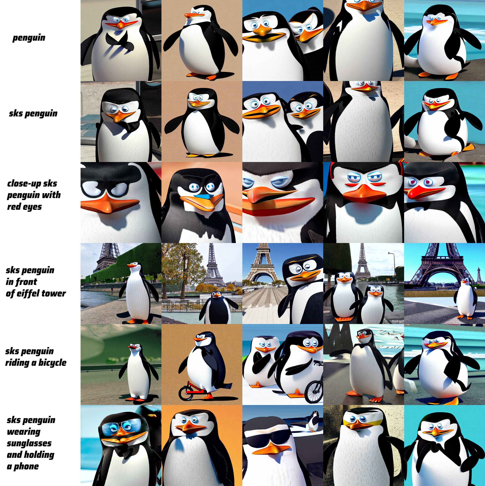
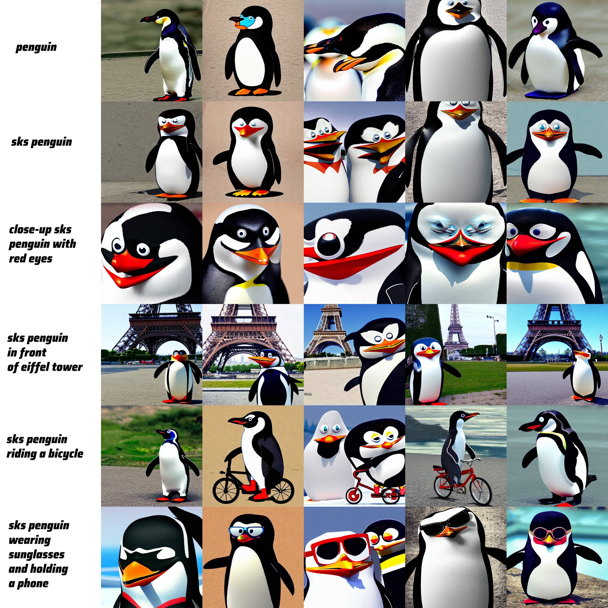
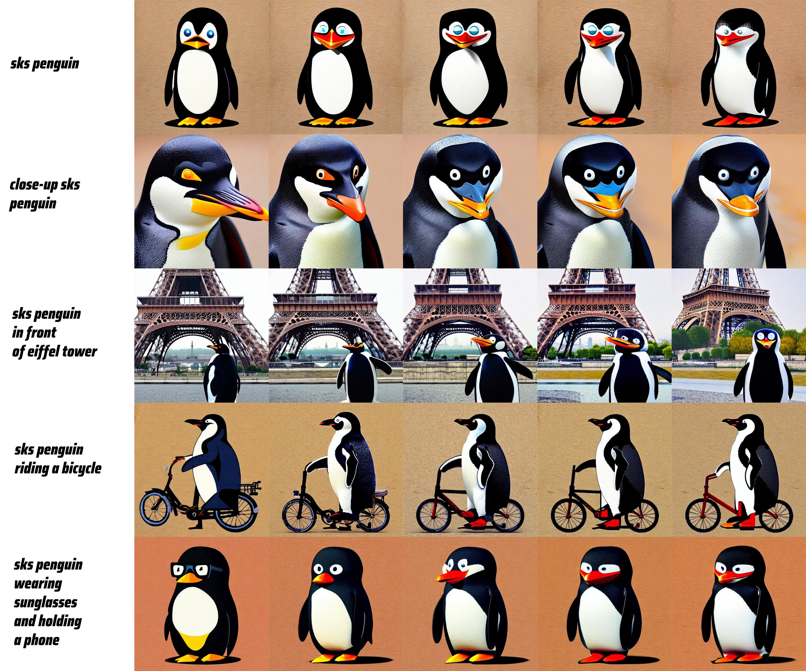
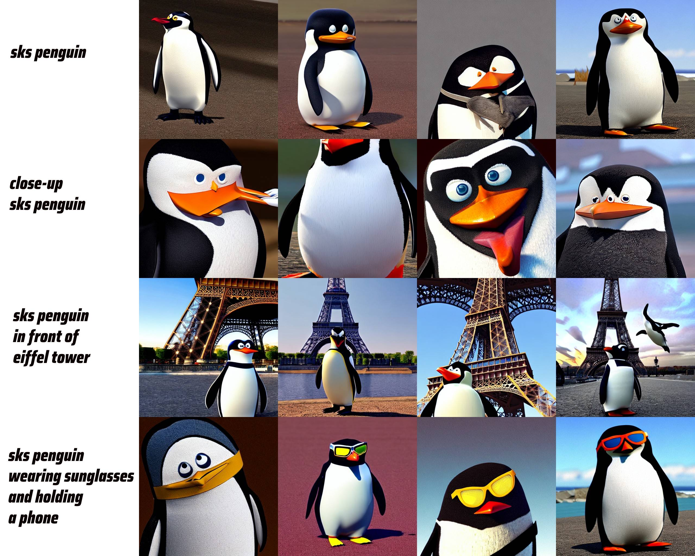
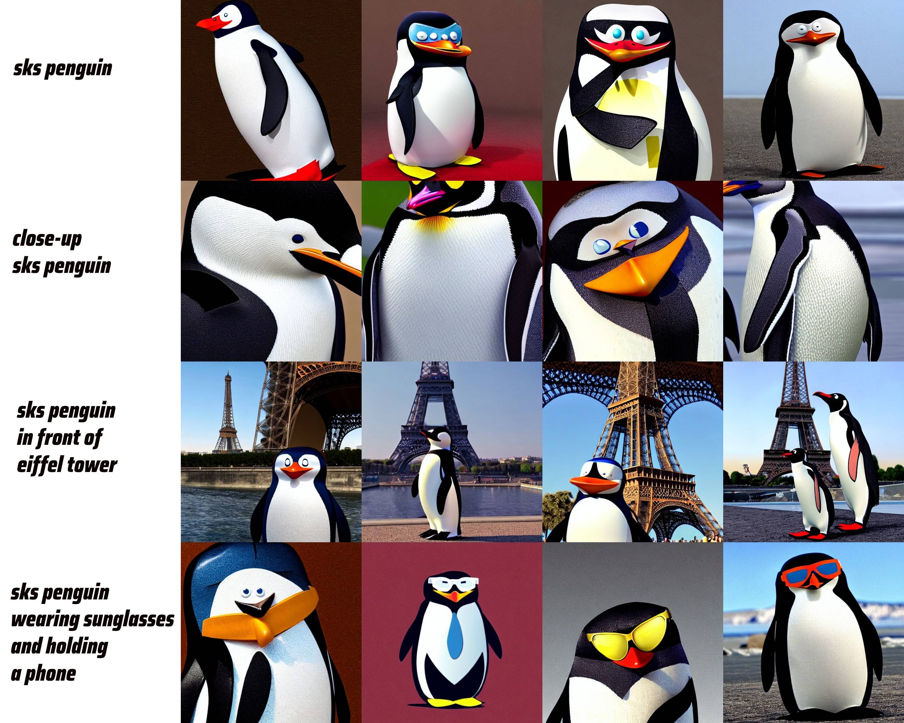
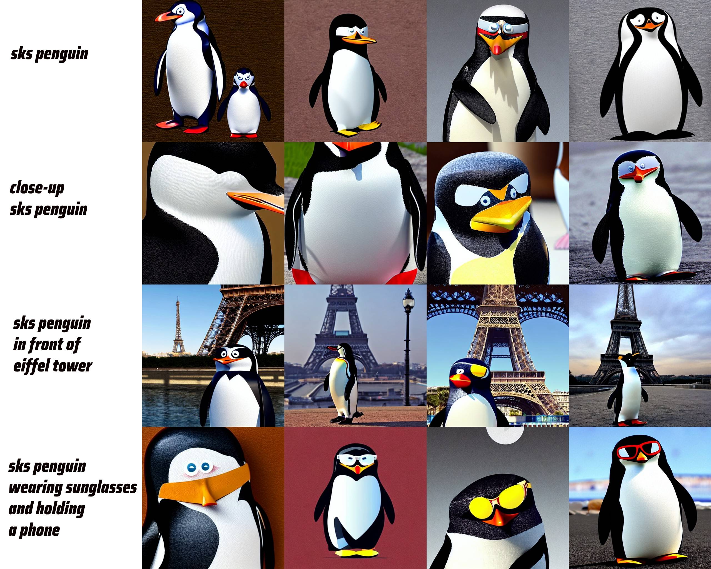
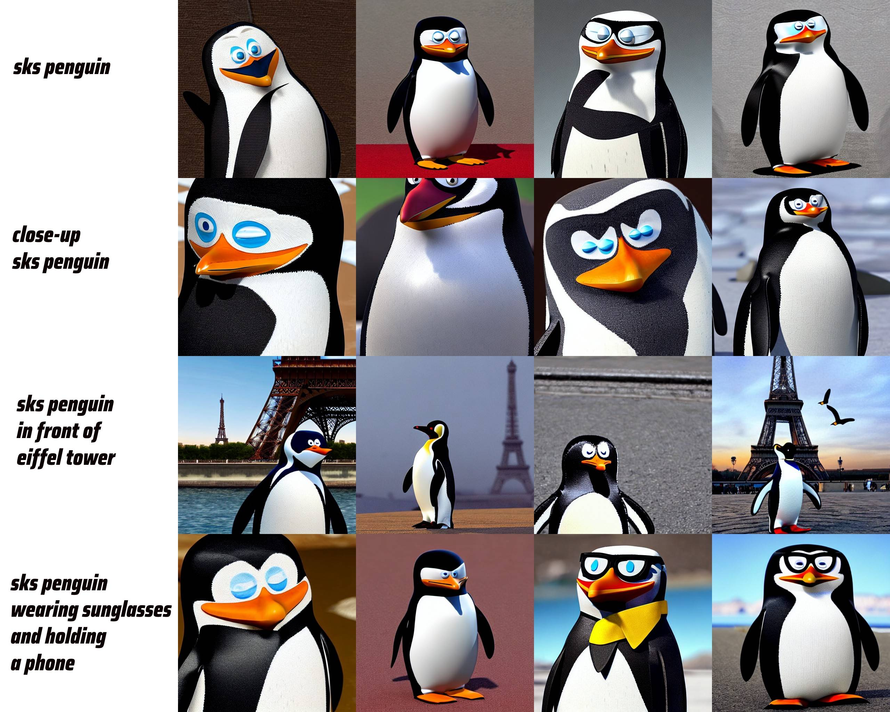
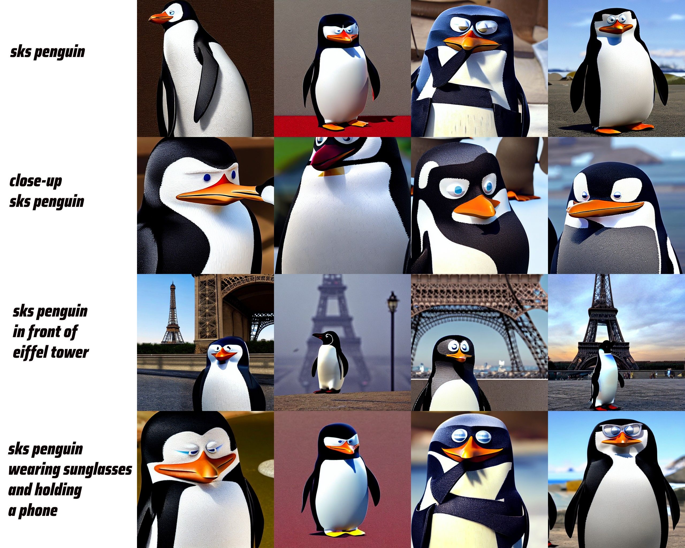

# Dreambooth_LoRA
## About
Repository of fine-tuning of deffusion model using LoRA. Process is based on [DreamBooth](https://arxiv.org/abs/2208.12242) paper.
## Annotation
The article describes fine-tuning technique of text-to-image model having just a few images of subject. This efficient technique allows reproducing subject in different conditions and preserve semantic class knowledge. Dreambooth solves two main problems: overfitting and language drift. In the article, the authors present two key methods: Class-specific Prior Preservation Loss and Rare-token Identifier. Class-specific Prior Preservation Loss allows preserving initial knowledge about specific classes. Rare-token Identifier (e.g. "sks") is special identifier of subject that allows to "implant" subject into model vocabulary. As a result giving a prompt with chosen token identifier model output unique image preserving the subject instance features. There many possibilities to the modification of a subject instance, some of these include drawing a subject in a different place, color modification, drawing the subject from a different angle and art renditions.

## Experiments
## Experiment settings 
[Instance parameters](https://github.com/amansyayf/Dreambooth_LoRA/blob/main/contents/args.json) for all experiments. [Images](https://drive.google.com/drive/folders/1pYxUPXJnd-HPvvYS2ivD6UYzuBuoeHDZ?usp=sharing) for subject. [Images](https://drive.google.com/drive/folders/1G_FZ7_f09dx-m0auFNULcBi3uEqkcEAp?usp=sharing) for regularization. [Training](https://github.com/amansyayf/Dreambooth_LoRA/blob/main/training.ipynb) notebook. [Inference](https://github.com/amansyayf/Dreambooth_LoRA/blob/main/inference.ipynb) notebook.
## Prior Preservation Loss 
Check in practice the importance of this Loss. Indeed, it looks preventing from overfitting and bringing diversity in pictures, when we have unusual prompts. But without using it better for betraying subject features. 

Columns represents seeds, [1000000, 2000000, 3000000, 4000000, 5000000] starting from the left

> Without Prior Loss
<!-- #region -->

<!-- #endregion -->

> With Prior Loss
<!-- #region -->

<!-- #endregion -->

## Learning Rate and number of training steps
Fine-tuning with all hyperparameters equal across runs, except LR, number of training steps.  In our case (lr=1e-4, steps=1500) or seems better. Lr=5e-5 led to fast overfitting (one image for any prompt). With fourth prompt model have failure, probably due to low probability of co-occurrence in the initial training set and overfitting. 

Columns of pictures represent training steps, [500, 1000, 1500, 2000, 2500] starting from the left. Seed = 2000000.

> Lr=5e-5
<!-- #region -->

<!-- #endregion -->

> Lr=1e-4
<!-- #region -->

<!-- #endregion -->

> Lr=5e-4
<!-- #region -->

<!-- #endregion -->

## LORA rank
Here it can be seen that as the rank increases, the quality increases. However, with it the use of memory and training parameters abruptly increases.
 
Columns of pictures represent seeds [1000, 2000, 3000, 4000] starting from the left.

> rank=1
<!-- #region -->

<!-- #endregion -->

> rank=2
<!-- #region -->

<!-- #endregion -->

> rank=4
<!-- #region -->

<!-- #endregion -->

> rank=6
<!-- #region -->

<!-- #endregion -->

> rank=8
<!-- #region -->

<!-- #endregion -->
